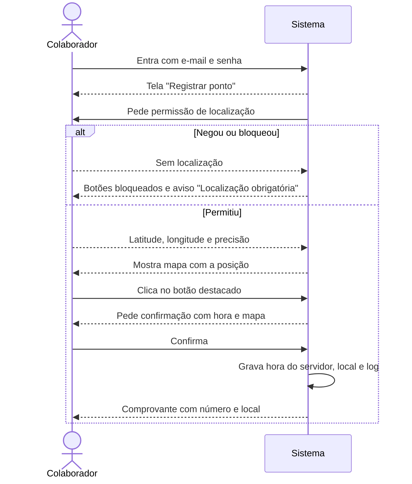
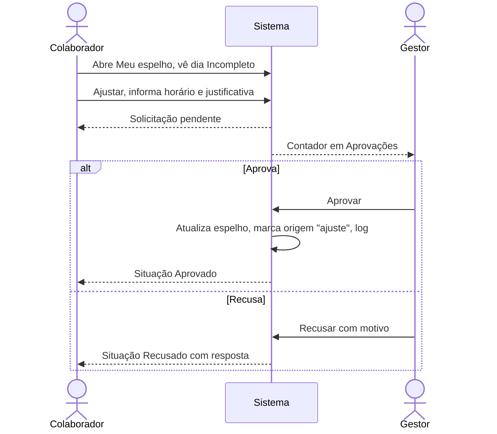
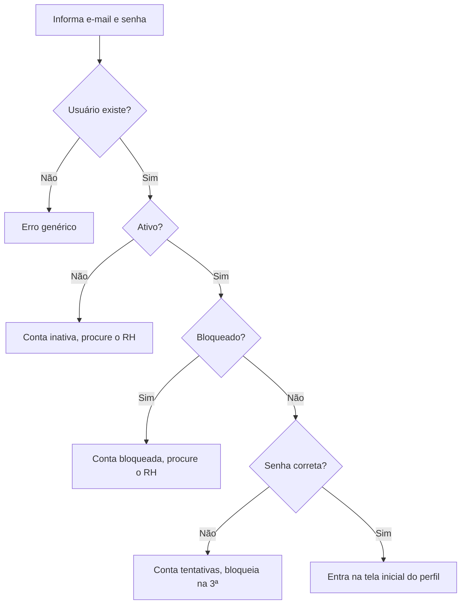
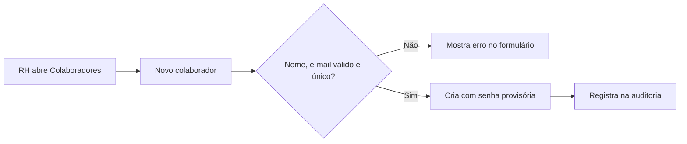
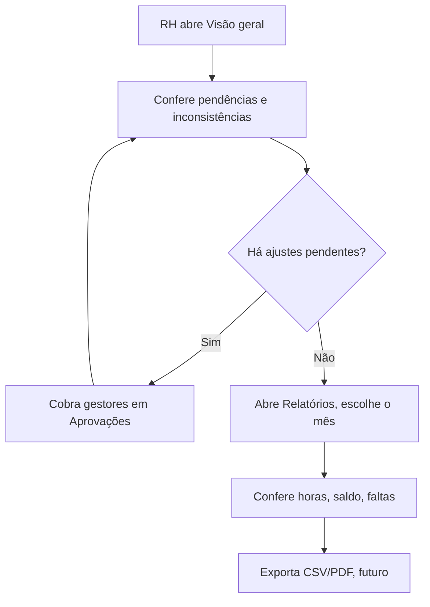

# 06 · Fluxos

## F1 · Registrar o ponto

```mermaid
sequenceDiagram
    actor C as Colaborador
    participant S as Sistema
    C->>S: Entra com e-mail e senha
    S-->>C: Tela "Registrar ponto"
    S->>C: Pede permissão de localização
    alt Negou ou bloqueou
        C-->>S: Sem localização
        S-->>C: Botões bloqueados e aviso "Localização obrigatória"
    else Permitiu
        C-->>S: Latitude, longitude e precisão
        S-->>C: Mostra mapa com a posição
        C->>S: Clica no botão destacado
        S-->>C: Pede confirmação com hora e mapa
        C->>S: Confirma
        S->>S: Grava hora do servidor, local e log
        S-->>C: Comprovante com número e local
    end
```

## F2 · Esqueci de bater o ponto

```mermaid
sequenceDiagram
    actor C as Colaborador
    participant S as Sistema
    actor G as Gestor
    C->>S: Abre Meu espelho, vê dia Incompleto
    C->>S: Ajustar, informa horário e justificativa
    S-->>C: Solicitação pendente
    S-->>G: Contador em Aprovações
    alt Aprova
        G->>S: Aprovar
        S->>S: Atualiza espelho, marca origem "ajuste", log
        S-->>C: Situação Aprovado
    else Recusa
        G->>S: Recusar com motivo
        S-->>C: Situação Recusado com resposta
    end
```

## F3 · Login

```mermaid
flowchart TD
    A[Informa e-mail e senha] --> B{Usuário existe?}
    B -->|Não| X[Erro genérico]
    B -->|Sim| C{Ativo?}
    C -->|Não| Y[Conta inativa, procure o RH]
    C -->|Sim| D{Bloqueado?}
    D -->|Sim| Z[Conta bloqueada, procure o RH]
    D -->|Não| E{Senha correta?}
    E -->|Não| F[Conta tentativas, bloqueia na 3ª]
    E -->|Sim| G[Entra na tela inicial do perfil]
```

## F4 · Novo colaborador

```mermaid
flowchart LR
    RH[RH abre Colaboradores] --> N[Novo colaborador]
    N --> V{Nome, e-mail válido e único?}
    V -->|Não| E[Mostra erro no formulário]
    V -->|Sim| OK[Cria com senha provisória]
    OK --> L[Registra na auditoria]
```

## F5 · Fechamento do mês

```mermaid
flowchart TD
    A[RH abre Visão geral] --> B[Confere pendências e inconsistências]
    B --> C{Há ajustes pendentes?}
    C -->|Sim| D[Cobra gestores em Aprovações]
    D --> B
    C -->|Não| E[Abre Relatórios, escolhe o mês]
    E --> F[Confere horas, saldo, faltas]
    F --> G[Exporta CSV/PDF, futuro]
```
